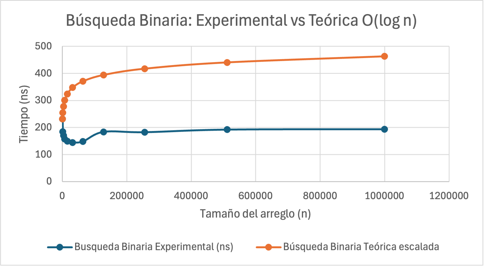
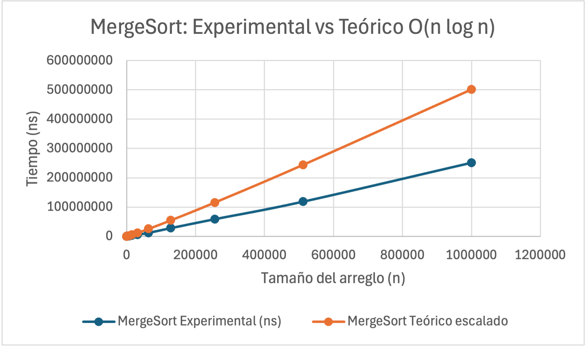

Se realiza un análisis empírico de los algoritmos Búsqueda Binaria y MergeSort, con el objetivo de comparar sus tiempos de ejecución experimentales con sus complejidades teóricas: O(log₂(n)) para Búsqueda Binaria y O(n·log₂(n)) para MergeSort.
Para realizar el benchmark se generan arreglos con valores aleatorios y distintos tamaños de entrada. Para cada tamaño se ejecutan ambos algoritmos múltiples veces y se mide su tiempo de ejecución en nanosegundos.
Las repeticiones permiten obtener tiempos promedio y reducir el efecto de las variaciones propias de una medición individual.
Además de los tiempos experimentales, se calculan los valores correspondientes a las funciones teóricas.
Los resultados obtenidos se almacenan en el archivo "resultados.csv" y se utilizan para generar gráficas comparativas entre el comportamiento experimental y el crecimiento esperado según el análisis teórico.
Las gráficas se incorporan en el archivo "graficas.xlsx".
La idea de este análisis es ver si conforme aumenta el tamaño de entrada n, el crecimiento medido presenta un comportamiento consistente con las complejidades esperadas de cada algoritmo.
En Búsqueda Binaria, el tamaño de entrada aumenta por un factor de 1000, mientras que log₂(n) aumenta aproximadamente de 9.97 a 19.93. Los tiempos experimentales permanecen en el orden de cientos de nanosegundos y presentan variaciones debido a que cada búsqueda es extremadamente rápida (factores como caché, procesador, sistema operativo o aleatorio de los datos, tienen una influencia considerable sobre la medición). Aun así, no se observa un crecimiento proporcional al tamaño del arreglo, lo cual es consistente con el lento crecimiento esperado de O(log₂(n)).
En MergeSort se observa una tendencia más clara. El tiempo experimental aumenta desde aproximadamente 250722 ns para 1000 elementos hasta 251224000 ns para 1000000 de elementos. La curva experimental presenta un patrón similar al crecimiento de O(n·log₂(n)). Además, para los tamaños mayores, el cociente toma valores aproximados de 12.82, 12.22 y 12.60, lo que muestra una tendencia relativamente estable. Esto indica que el tiempo de ejecución crece aproximadamente de manera proporcional a n·log₂(n), consistente con la complejidad teórica O(n·log₂(n)).
En conclusión, el análisis asintótico describe la tasa de crecimiento y elimina factores constantes, pero los tiempos reales también dependen del hardware, compilador, memoria y condiciones del sistema durante cada ejecución.

## Búsqueda Binaria - O(log₂(n)): 

## MergeSort - O(n·log₂(n)): 
